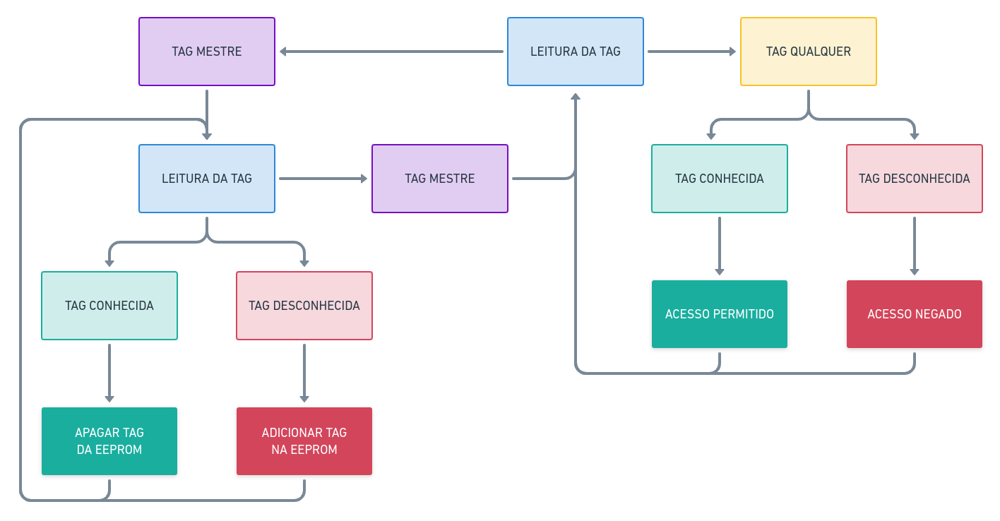

# Controle de Acesso
O sistema desenvolvido tem como objetivo fazer o controle de autenticação via cartão magnético.

## Fluxo de funcionamento


## Funcionalidades
- [X] Cadastro de TAG mestre
  - [X] Inserção
  - [X] Remoção
- [X] Cadastro de TAG usuário
  - [X] Inserção
  - [X] Remoção
- [ ] Interface computacional Amigável
  - [X] Mensagens de debug
  - [ ] Mensagens para usuário
- [ ] API para banco de dados externo

## Infraestrutura
* **Plataforma:** Atmel AVR 3.1.0
* **Placa:** uno
* **Framework:** Arduino

## Pré-requisitos para rodar projeto
### Eletrônicos
* Arduino uno
* Sensor RFID522
* Protobord
* 3 Leds (verde,amarelo,azul)
* 3 resistências (200 ohm)
* 12 jumpers

#### Mapeamento sensor RFID para cada microcontroladores Arduino

<table>
        <thead>
          <tr>
            <th>Signal</th>
            <th>MFRC522 Reader/PCD</th>
            <th>Uno/101</th>
            <th>Mega</th>
            <th>Nano V3</th>
            <th>Leonardo/Micro</th>
            <th>Pro Micro</th>
          </tr>
        </thead>
        <tbody>
          <tr>
            <td>RST/Reset</td>
            <td>RST</td>
            <td>9</td>
            <td>5</td>
            <td>D9</td>
            <td>RESET/ICSP-5</td>
            <td>RST</td>
          </tr>
          <tr>
            <td>SPI SS</td>
            <td>SDA(SS)</td>
            <td>10</td>
            <td>53</td>
            <td>D10</td>
            <td>10</td>
            <td>10</td>
          </tr>
          <tr>
            <td>SPI MOSI</td>
            <td>MOSI</td>
            <td>11 / ICSP-4</td>
            <td>51</td>
            <td>D11</td>
            <td>ICSP-4</td>
            <td>16</td>
          </tr>
          <tr>
            <td>SPI MISO</td>
            <td>MISO</td>
            <td>12 / ICSP-1</td>
            <td>50</td>
            <td>D12</td>
            <td>ICSP-1</td>
            <td>14</td>
          </tr>
          <tr>
            <td>SPI SCK</td>
            <td>SCK</td>
            <td>13 / ICSP-3</td>
            <td>52</td>
            <td>D13</td>
            <td>ICSP-3</td>
            <td>15</td>
          </tr>
        </tbody>
      </table>

### Programas
* [ArduinoIDE](https://www.arduino.cc/en/software)
* [Java 8](https://adoptopenjdk.net/) (Dependência arduinoIDE)
* [PlataformIO](https://platformio.org)
* [Vscode](https://code.visualstudio.com/)
> a preferência pelo Vscode vem de sua integração com a plataformaIO que agiliza o processo de desenvolvimento sem dependẽncia do CLI

### Bibliotecas
* [MFRC522 1.4.7](https://github.com/miguelbalboa/rfid?utm_source=platformio&utm_medium=piohome)
* Framework Arduino AVR (Dependências puxadas pelo PlataformIO)
  * HID 1.0
  * SPI 1.0
  * Wire 1.0
  * EEPROM 2.0
  * SoftwarSerial 1.0

## Como rodar a aplicação
Levando conta que tudo ocorreu como os conformes nos [Pré-requisitos](#Pré-requisitos), temos então o ambiente do Vscode, nele existe os botões na barra inferior que fazem o upload do programa para o microcontrolador, executado este, abrimos o serial monitor para receber as mensagens do arduino, assim inicia-se o [fluxo](#Fluxo de funcionamento) da aplicação com sucesso.
> Nota-se que não é necessário a observação pelo serial monitor, os leds indicam o estado da aplicação.

### PlataformIO CLI
Supondo que não deseje utilizar Vscode, através do CLI, basta rodar o comando:
```shell
pio run --target upload
```

Em caso de dúvidas, acessar a documentação oficial [PlataformIO](https://docs.platformio.org/en/latest/core/quickstart.html).

## Licença: The Unlicense
This is free and unencumbered software released into the public domain.

Anyone is free to copy, modify, publish, use, compile, sell, or
distribute this software, either in source code form or as a compiled
binary, for any purpose, commercial or non-commercial, and by any
means.

In jurisdictions that recognize copyright laws, the author or authors
of this software dedicate any and all copyright interest in the
software to the public domain. We make this dedication for the benefit
of the public at large and to the detriment of our heirs and
successors. We intend this dedication to be an overt act of
relinquishment in perpetuity of all present and future rights to this
software under copyright law.

THE SOFTWARE IS PROVIDED "AS IS", WITHOUT WARRANTY OF ANY KIND,
EXPRESS OR IMPLIED, INCLUDING BUT NOT LIMITED TO THE WARRANTIES OF
MERCHANTABILITY, FITNESS FOR A PARTICULAR PURPOSE AND NONINFRINGEMENT.
IN NO EVENT SHALL THE AUTHORS BE LIABLE FOR ANY CLAIM, DAMAGES OR
OTHER LIABILITY, WHETHER IN AN ACTION OF CONTRACT, TORT OR OTHERWISE,
ARISING FROM, OUT OF OR IN CONNECTION WITH THE SOFTWARE OR THE USE OR
OTHER DEALINGS IN THE SOFTWARE.

For more information, please refer to <http://unlicense.org/>
